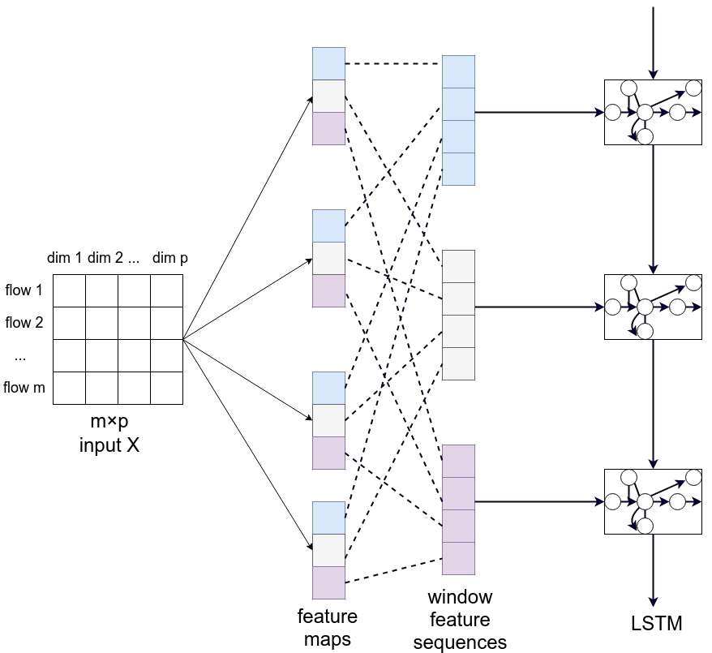

<!--
 * @Descripttion: 
 * @Version: 1.0
 * @Author: ZhangHongYu
 * @Date: 2022-07-04 17:31:00
 * @LastEditors: ZhangHongYu
 * @LastEditTime: 2022-07-07 15:14:04
-->
<!--
 * @Descripttion: 
 * @Version: 1.0
 * @Author: ZhangHongYu
 * @Date: 2022-07-03 20:27:59
 * @LastEditors: ZhangHongYu
 * @LastEditTime: 2022-07-04 17:04:43
-->
<p align="center">

</p>

<div align="center">

# AIFlow: 基于CNN+LSTM的流量分析识别系统

[](https://github.com/orion-orion/CNN-LSTM-Flow-Analysis)[](https://github.com/orion-orion/CNN-LSTM-Flow-Analysis/blob/master/LICENSE)[](https://github.com/orion-orion/CNN-LSTM-Flow-Analysis)
<br/>
[](https://github.com/orion-orion/CNN-LSTM-Flow-Analysis) [](https://github.com/orion-orion/CNN-LSTM-Flow-Analysis) 
</div>

## 1 简介
[AIFlow](https://github.com/orion-orion/CNN-LSTM-Flow-Analysis)为2020年[中国高校计算机大赛(C4)－网络技术挑战赛](http://net.c4best.cn/)EP2决赛赛项，题目为构建一个在线流量识分析与识别系统，能够实时识别出网络上的正常业务流量、恶意软件流量和网络攻击流量，并对各种流量随时序的变化进行进行可视化展示，我们采用**CNN+LSTM时空神经网络**，其中CNN对流量空间特征进行提取，LSTM对流量时序特征进行提取，从而完成不同种类流量分类功能。我们将思博伦官方给出的流量pcap包解析为流量的URL进行训练, 最终在官方给出的测试流量包上达到 **93.5%** 的准确率。

<p align="center">

</p>

## 2 环境依赖
运行以下命令安装环境依赖：
```bash
pip install -r requirements.txt
```
注意我的Python版本是 3.8.15 且 CUDA 版本是 11。因为 Tensorflow 1.15 只支持Python 3.7 和CUDA 10，所以我使用了下列命令以在 CUDA 11 上安装 Tensorflow 1.15:

```bash
pip install --upgrade pip
pip install nvidia-pyindex
pip install nvidia-tensorflow[horovod]
pip install nvidia-tensorboard==1.15
```

## 3 数据集
已经搜集好的训练数据以`csv`格式存储于`data`目录下. `csv`文件第一行的列名需要为`["label", "content"]` 或者`["content", "label"]`（我们这里采用前者）。其中`0`标签表示为业务流量，`1`标签表示为网络攻击流量，`2`标签表示为恶意软件流量。

## 4 模型

您可以自由选择包括C-LSTM时空神经网络在内的以下模型使用
- LSTM分类器（参见`rnn_classifier.py`）。
- 双向LSTM分类器（参见`rnn_classifier.py`）。
- CNN分类器（参见`cnn_classifier`）。参考: [Implementing a CNN for Text Classification in Tensorflow](http://www.wildml.com/2015/12/implementing-a-cnn-for-text-classification-in-tensorflow/).
- C-LSTM分类器（参见`clstm_classifier.py`）。 参考: [A C-LSTM Neural Network for Text Classification](https://arxiv.org/abs/1511.08630).

我本地训练好的模型在`model/1600693479`目录下，其参数配置`params.pkl`以及向量化预处理文件`vocab`已经保存在`params`目录下，大家可直接加载使用。

## 5 项目目录说明

```bash
├── data                                   存放数据

├── model                                  存放模型参数

├── params                                 存放模型超参数相关信息和向量化预处理信息

├── prediction                             存放对测试流量的预测结果

├── summaries                              模型训练和验证信息（用于Tensorboard可视化展示）

├── clstm_classifier.py                    CNN+LSTM分类器的实现

├── cnn_classifier                         CNN分类器的实现

├── data_helper                            完成预处理向量化操作

├── rnn_classifier.py                      LSTM分类器和双向LSTM分类器的实现

├── test.py                                完成模型在测试集上的测试操作

├── train.py                               完成模型在训练集上的训练操作和在验证集上的验证操作

```
## 6 使用方法
### 6.1 训练

您可以运行`train.py`来训练模型。例如:
```bash
python train.py --data_file=data/data.csv --clf=clstm
```
其中`--clf`参数用于指定所采用的模型，默认设置为`clstm`（即CNN+LSTM模型）。您还可以设置为`cnn`、`lstm`、`blstm`，分别对应CNN、LSTM和Bi-LSTM模型。

训练完成后, 你可以使用`tensorboard`来查看计算图, 损失函数和评价指标的可视化:  

```bash
tensorboard --logdir=summaries
```

### 6.2 测试
您可以运行`test.py`来评估训练好的模型。例如:
```bash
python test.py --test_data_file=data/test_data.csv --prediction_dir=prediction --model_dir=model/1600693479 --params_dir=params
```
